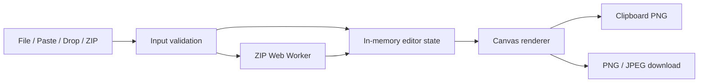

# Architecture

## Runtime architecture



Cloudflare Pages serves only the exported HTML, CSS, JavaScript, and local static assets. There is no application server.

## Proposed directories

```text
src/
├── app/
│   ├── globals.css
│   ├── layout.tsx
│   └── page.tsx
├── components/
│   └── image-editor/
│       ├── ImageEditor.tsx
│       ├── InputArea.tsx
│       ├── JoinSettings.tsx
│       ├── SortableImageList.tsx
│       ├── SortableImageItem.tsx
│       ├── CropDialog.tsx
│       ├── PreviewCanvas.tsx
│       ├── ExportActions.tsx
│       └── StatusMessage.tsx
├── lib/
│   ├── clipboard.ts
│   ├── image-decode.ts
│   ├── image-signature.ts
│   ├── layout.ts
│   ├── natural-sort.ts
│   ├── render.ts
│   ├── resource-cleanup.ts
│   ├── validation.ts
│   └── zip-client.ts
├── workers/
│   └── zip.worker.ts
└── types/
    └── editor.ts
tests/
└── unit/
```

## State model

```ts
type CropRect = {
  x: number;
  y: number;
  width: number;
  height: number;
};

type ImageItem = {
  id: string;
  name: string;
  source: "file" | "paste" | "zip";
  blob: Blob;
  bitmap: ImageBitmap;
  originalWidth: number;
  originalHeight: number;
  crop: CropRect | null;
  rotation: 0 | 90 | 180 | 270;
  targetWidth: number | null;
};

type EditorState = {
  items: ImageItem[];
  direction: "vertical" | "horizontal";
  sizeMode: "original" | "fitWidth" | "fitHeight" | "custom";
  customSize: number | null;
  gap: number;
  background: string;
  format: "png" | "jpeg";
  jpegQuality: number;
  processing: number; // count of in-flight add-image batches; > 0 means loading
  error: AppError | null;
};
```

## Design rules

- Store the original Blob and transformation metadata. Do not create a new full-size Blob after every edit.
- Keep placement and output-dimension calculations pure and independently tested.
- Decode normal files on the main browser boundary; decompress ZIP data inside a Worker.
- Transfer ArrayBuffers to the Worker rather than cloning large buffers where supported.
- Treat Clipboard, Canvas, object URLs, and Worker lifecycle as replaceable adapters.
- Render preview and final output through the same layout calculation to prevent discrepancies.
- Perform output size checks before allocating the final Canvas.

## Static export restrictions

`next.config.ts` uses `output: "export"`. Do not introduce functionality that requires a request-time Next.js server. User-loaded Blob URLs are rendered with native `` or Canvas rather than the default `next/image` optimization service.

