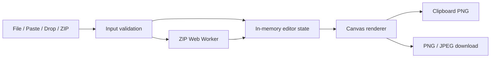

# Architecture

## Runtime architecture



A Cloudflare Worker configured for static assets only (`wrangler.jsonc`, `assets.directory: "./out"`, no `main` script) serves the exported HTML, CSS, JavaScript, and local static assets. There is no application server.

## Proposed directories

```text
src/
├── app/
│   ├── globals.css
│   ├── layout.tsx
│   └── page.tsx
├── components/
│   └── image-editor/
│       ├── ImageEditor.tsx
│       ├── InputArea.tsx
│       ├── JoinSettings.tsx
│       ├── SortableImageList.tsx
│       ├── SortableImageItem.tsx
│       ├── CropDialog.tsx
│       ├── PreviewCanvas.tsx
│       ├── ExportActions.tsx
│       └── StatusMessage.tsx
├── lib/
│   ├── clipboard.ts
│   ├── image-decode.ts
│   ├── image-signature.ts
│   ├── layout.ts
│   ├── natural-sort.ts
│   ├── render.ts
│   ├── resource-cleanup.ts
│   ├── validation.ts
│   └── zip-client.ts
├── workers/
│   └── zip.worker.ts
└── types/
    └── editor.ts
tests/
└── unit/
```

## State model

```ts
type CropRect = {
  x: number;
  y: number;
  width: number;
  height: number;
};

type ImageItem = {
  id: string;
  name: string;
  source: "file" | "paste" | "zip";
  blob: Blob;
  bitmap: ImageBitmap;
  originalWidth: number;
  originalHeight: number;
  crop: CropRect | null;
  rotation: 0 | 90 | 180 | 270;
  targetWidth: number | null;
};

type EditorState = {
  items: ImageItem[];
  direction: "vertical" | "horizontal";
  sizeMode: "original" | "fitWidth" | "fitHeight" | "custom";
  customSize: number | null;
  gap: number;
  background: string;
  format: "png" | "jpeg";
  jpegQuality: number;
  processing: number; // count of in-flight add-image batches; > 0 means loading
  error: AppError | null;
};
```

## Design rules

- Store the original Blob and transformation metadata. Do not create a new full-size Blob after every edit.
- Keep placement and output-dimension calculations pure and independently tested.
- Decode normal files on the main browser boundary; decompress ZIP data inside a Worker.
- Transfer ArrayBuffers to the Worker rather than cloning large buffers where supported.
- Treat Clipboard, Canvas, object URLs, and Worker lifecycle as replaceable adapters.
- Render preview and final output through the same layout calculation to prevent discrepancies.
- Perform output size checks before allocating the final Canvas.
- `CropDialog`'s wrapper→cropperjs display scale is per-axis (`{x, y}`), not a single uniform value: an axis whose proportional size would round below `MIN_WRAPPER_DIMENSION` (24px) gets its own floor scale instead, so extreme-aspect-ratio images (e.g. 1×10000) keep a clickable, draggable selection area. Confirmed via `integration-spike` (2026-09-09, Issue #63) that cropperjs's internal `<cropper-image>` layout is fixed at `new Cropper(...)` time and does not react to a later pure-CSS resize of its container — the correct size must be set before initialization, which the existing effect ordering already does.
- ZIP encryption-flag detection (`src/lib/zip-central-directory.ts`) self-parses the central directory instead of trusting `fflate`, because `integration-spike` (2026-09-14, Issue #65) confirmed with real ZIP bytes: (1) `fflate`'s read-side types expose no encryption/flag field, only name/size; (2) `fflate`'s `unzipSync` does **not** reliably fail on a structurally-corrupt central directory — it silently returned a valid entry from a ZIP whose CD signature had been overwritten, so a self-parser's own failure must independently force rejection rather than assuming `fflate` will also reject; (3) the central-directory general-purpose bit-flag offset (`+8` from each CD record) and a real `zip -P`-encrypted archive both confirmed bit 0 set as expected; (4) a ZIP64 sentinel value (`0xFFFFFFFF`) in the classic EOCD's `cdOffset` naturally fails a plain "offset within buffer" bounds check, so no dedicated ZIP64 detection code was added — strict bounds validation is relied on instead; (5) appending a second, structurally-valid-looking EOCD after the real one made both `fflate` and a naive backward scanner agree on the (fake) trailing one in the tested case, but exact agreement isn't proven for all inputs, so the parser fails closed (`malformed`) on any structural inconsistency rather than trying to be lenient. Entries are walked using only their declared length fields, never their decoded name, avoiding the UTF-8-vs-Latin-1 filename-encoding ambiguity `fflate` itself has (bit 11 dependent). Real-world compatibility (not just `fflate`-authored fixtures) was checked against an archive built by the system `zip` CLI (multiple files plus a subdirectory) — accepted correctly, matching `fflate`'s own extraction result.

## Static export restrictions

`next.config.ts` uses `output: "export"`. Do not introduce functionality that requires a request-time Next.js server. User-loaded Blob URLs are rendered with native `` or Canvas rather than the default `next/image` optimization service.

