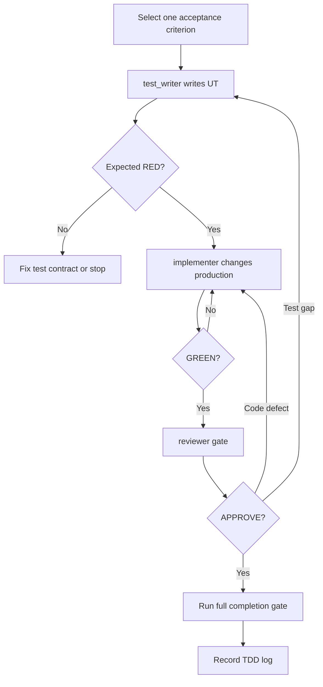

# TDD Multi-Agent Workflow

## Agents

| Agent | Writes | Must not write | Purpose |
| --- | --- | --- | --- |
| `test_writer` | Tests and test-only fixtures | Production code | Express one behavior and prove RED |
| `implementer` | Production code | Tests | Make the smallest change and prove GREEN |
| `reviewer` | Nothing | All files | Review tests and code; approve or reject |

The primary Codex thread is the orchestrator. Agents run sequentially because both test and implementation work modifies the same working tree.

## Loop

## Primary-agent protocol

1. Choose exactly one small observable behavior from `docs/IMPLEMENTATION_PLAN.md`.
2. State its acceptance criteria and relevant files.
3. Spawn `test_writer` and wait.
4. Inspect RED evidence. Do not accept environment errors as RED.
5. Spawn `implementer` and wait.
6. Inspect GREEN evidence.
7. Spawn `reviewer` and wait for `APPROVE` or `REQUEST_CHANGES`.
8. Route only the review finding to the responsible agent.
9. Stop after three review cycles if the gate still fails.
10. Update `docs/TDD_LOG.md` only after APPROVE and full checks.

## Unit-test boundaries

High-value pure units:

- natural filename sorting
- image signature detection
- file and ZIP limit validation
- rotation dimension calculation
- crop rectangle normalization
- width/height fit calculations
- vertical and horizontal placement calculation
- output size guard
- ZIP entry filtering
- reducer state transitions

High-value component behaviors:

- paste adds only image items
- drop accepts images and ZIPs
- drag end changes order and preview order
- keyboard sorting updates order
- mobile actions expose accessible controls
- copy success and failure feedback
- delete and unmount cleanup
- ZIP cancellation and error messages

## RED rules

A valid RED result is a test assertion failure caused by missing or wrong product behavior. Syntax errors, missing packages, broken Jest setup, or an unavailable DOM API are test-environment failures and must be fixed before the TDD loop proceeds.

## GREEN rules

GREEN means the narrow test target passes without weakening tests. After narrow GREEN, run the impacted suite. The full completion gate runs only after reviewer approval.

## Review limit

The maximum is three REVIEW → correction cycles per behavior. When exceeded, stop and return:

- unresolved finding
- attempted fixes
- current failing checks
- decision needed from the user

