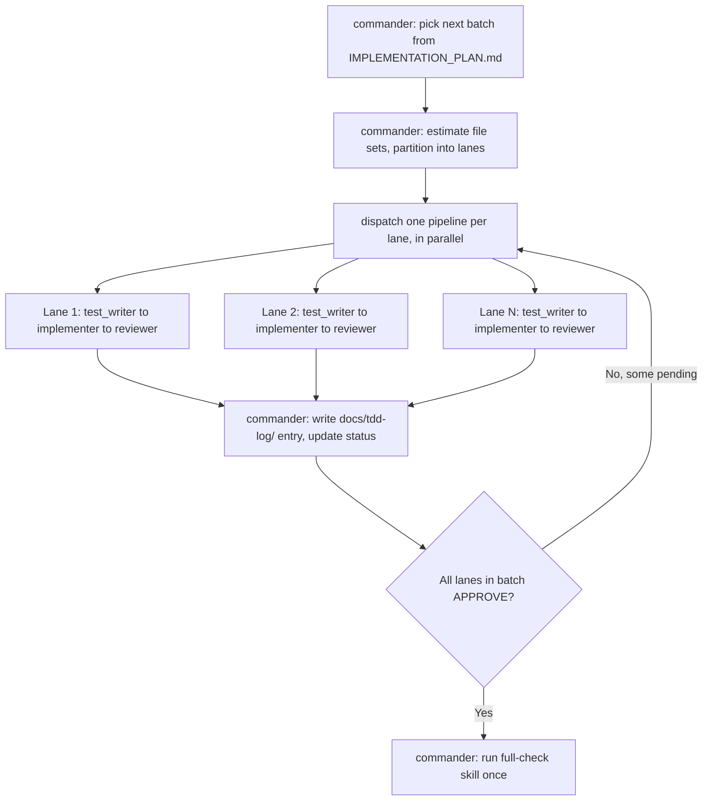
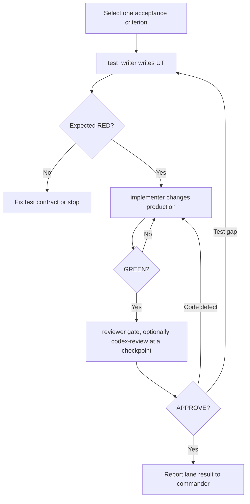

# TDD Multi-Agent Workflow

## Agents

| Agent | Writes | Must not write | Purpose |
| --- | --- | --- | --- |
| `commander` | Nothing except `docs/TDD_LOG_STATUS.md` and `docs/tdd-log/` entries | Everything else | Pick the next batch from `docs/IMPLEMENTATION_PLAN.md`, partition it into parallel lanes by file ownership, dispatch one pipeline per lane, then serialize the shared-file steps (status update, full check) once lanes finish |
| `test_writer` | Tests and test-only fixtures | Production code | Express one behavior and prove RED |
| `implementer` | Production code | Tests | Make the smallest change and prove GREEN |
| `reviewer` | Nothing | All files | Review tests and code; approve or reject. For an independent external opinion at a batch checkpoint or on user request, use the `codex-review` skill instead of (or alongside) self-review — not every cycle, since it spends the user's own Codex quota |

The primary agent thread *is* the commander — this is not a separate standing
agent you spawn on top of the others. Within one lane, `test_writer` →
`implementer` → `reviewer` still run strictly sequentially, because both
test and implementation work modify the same files. Across lanes that touch
disjoint files, pipelines may run concurrently — see "Parallel lanes" below.

## Parallel lanes

Two behaviors are **parallel-safe** only if their expected source and test
file sets are disjoint. If they overlap at all, put them in the same lane
and keep them sequential — this extends the existing "never overlap
writers" rule from single files to whole lanes.

- **Within a lane**: `test_writer` → `implementer` → `reviewer` stays
  strictly sequential, as always.
- **Across lanes**: pipelines run concurrently once `commander` has
  confirmed their file sets don't overlap.
- **Writes to the same file stay serialized; moving the log to one file
  per entry doesn't change who writes it.** `docs/TDD_LOG_STATUS.md` and
  every `docs/tdd-log/` entry are still written by `commander` alone, one
  at a time, in the order lanes report `APPROVE`, never concurrently — the
  same rule as before, just spread across more (smaller) files. What
  changes is merge-time behavior, not who writes or when: a `docs/tdd-log/`
  entry no longer shares a line region with `docs/TDD_LOG_STATUS.md` or
  with another entry, so an unrelated branch's change can no longer
  collide with it. Two different branches can still independently pick the
  same date+slug filename for unrelated entries; `docs/tdd-log/README.md`'s
  naming section covers that case (an ordinary add/add filename conflict
  at merge time, not a lost edit). Likewise, the project-wide `full-check`
  skill run (which touches shared build output like `.next/`) happens
  once, after a lane — or the whole batch — is ready, not once per lane in
  parallel.
- **Log-entry granularity**: when one lane covers several similar cases
  (sharing the same calculation logic or the same component), the internal
  RED→GREEN loop may still run once per case, but the log entry is written
  once, as a single `docs/tdd-log/` file, when the lane finishes (all
  cases `APPROVE`).
- Most entries under "High-value pure units" below live in their own file
  with no shared state (natural-sort, image-signature, zip limits, rotation
  dimension math, crop-rect normalization, fit calculations, placement
  calculations, the output-size guard, zip entry filtering, reducer
  transitions) — these are the strongest parallel-lane candidates. Entries
  under "High-value component behaviors" more often share `page.tsx` or
  `ImageList.tsx` and are more likely to end up serialized in one lane.

## Batch flow (commander)

Each `Lane` box above is the per-behavior loop:

## Primary-agent protocol

The two diagrams above are the source of truth for the batch/lane sequence.
This section only adds what they don't show:

- Before starting a lane, `commander` states its acceptance criteria and
  owned files — this is also the *only* handoff each spawned agent gets:
  requirement ID, acceptance criteria (plus any `screenshot-acceptance`
  scenarios chosen for UI/image/limits-async behavior), owned files, the
  relevant spec section(s), and (if resuming after a review finding) the
  last review result. Never hand off the full conversation or the full
  `docs/TDD_LOG.md`.
- **High-risk gate**: if a lane's target either (a) hands DOM/coordinate/event
  ownership to a third-party UI library (e.g. cropperjs), or (b) parses an
  untrusted external data format (e.g. ZIP), use the `integration-spike`
  skill for oracle verification before starting `test_writer`. Record the
  result in 1–2 lines in the relevant module's description in
  `docs/ARCHITECTURE.md`, and write mocks/tests only from that result, not
  from assumptions about the library.
- RED/GREEN evidence must be inspected by `commander`, not assumed:
  environment errors (broken Jest setup, missing packages) are not RED, and
  a narrow-suite pass is not GREEN if it required weakening a test. The same
  standard applies to `reviewer`'s own findings, split by what kind of claim
  is being made: a runtime-behavior finding (a bug, a regression, a broken
  interaction) must cite a re-run check (test/build/CI log/browser) — and a
  calendar-date difference between a UTC and a local-time reading of the same
  instant is expected, not a defect, unless the requirement specifically
  calls for UTC (e.g. `src/lib/download.ts`'s filename timestamp is
  deliberately local time; see its `docs/TDD_LOG.md` entry). A
  statically-decidable finding (a CSS class reused for the wrong purpose,
  wording that doesn't match what a nearby comment says it's for, a stale
  cross-reference) needs no re-run — citing the exact location and the
  concrete mismatch is sufficient evidence on its own. A finding that is
  neither reproduced nor statically decidable is a hypothesis, not a
  finding — say so explicitly rather than presenting a guess as either kind
  of evidence. This loosens *what counts as* evidence, not *whether* it's
  required.
- **Cross-cutting check**: when fixing a valid finding, check the other call
  sites, similar processing, or reference docs that shared the assumption
  the finding broke, and add "the property the original code already
  satisfied still holds" to that fix's acceptance criteria — not just "the
  finding's specific complaint is gone." (Example: a memory-capped preview
  fix that shrank the *drawn* resolution also shrank the *layout* size it
  fed back, silently breaking the existing guarantee that rotating an image
  doesn't change its apparent size — see `docs/TDD_LOG.md`'s 2026-09-05
  round-2 entry.) Scope this to the call sites, processing, and docs
  actually related to the change — not a full-codebase audit on every fix.
- See "Review limit" below for when to stop routing findings back and ask
  the user instead.

## Unit-test boundaries

High-value pure units:

- natural filename sorting
- image signature detection
- file and ZIP limit validation
- rotation dimension calculation
- crop rectangle normalization
- width/height fit calculations
- vertical and horizontal placement calculation
- output size guard
- ZIP entry filtering
- reducer state transitions

High-value component behaviors:

- paste adds only image items
- drop accepts images and ZIPs
- drag end changes order and preview order
- keyboard sorting updates order
- mobile actions expose accessible controls
- copy success and failure feedback
- delete and unmount cleanup
- ZIP cancellation and error messages

## RED rules

A valid RED result is a test assertion failure caused by missing or wrong product behavior. Syntax errors, missing packages, broken Jest setup, or an unavailable DOM API are test-environment failures and must be fixed before the TDD loop proceeds.

## GREEN rules

GREEN means the narrow test target passes without weakening tests. After narrow GREEN, run the impacted suite. The `full-check` skill (project-wide test/typecheck/lint/build) runs only after reviewer approval, and only once per lane or batch — not repeated per file change.

## Review limit

The maximum is three REVIEW → correction cycles per behavior. When exceeded, stop and return:

- unresolved finding
- attempted fixes
- current failing checks
- decision needed from the user

**Minor-only cutoff**: once every Critical/Major finding is resolved and the
behavior meets its acceptance criteria, outstanding Minor findings alone do
not force another correction round. Fix the ones that are cheap to fix in
the round already underway; for anything left over, record it (in the
`docs/tdd-log/` entry, with the reason it was left) rather than silently
dropping it or looping again to chase it down. This is separate from the
three-cycle cap above, which still applies in full when Critical/Major
findings are in play.

