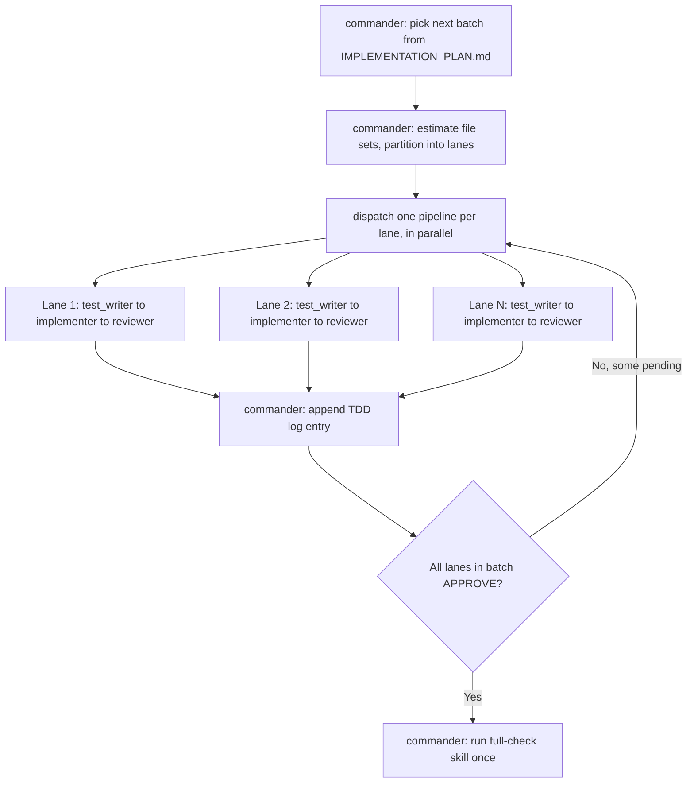
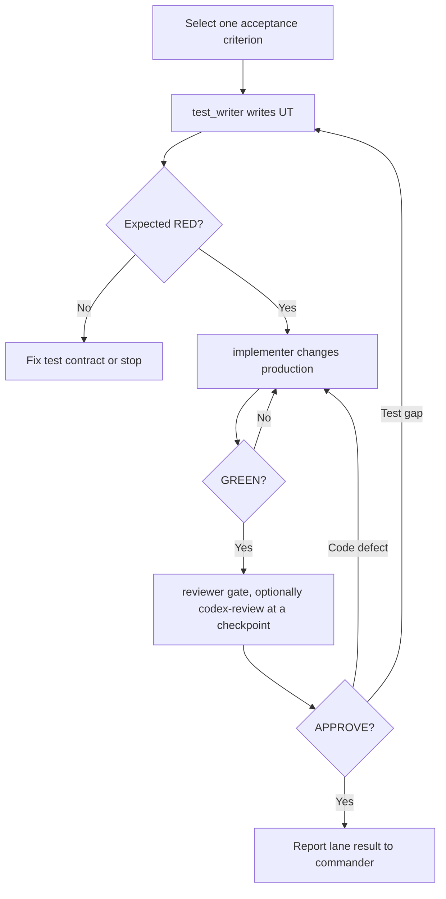

# TDD Multi-Agent Workflow

## Agents

| Agent | Writes | Must not write | Purpose |
| --- | --- | --- | --- |
| `commander` | Nothing | All files | Pick the next batch from `docs/IMPLEMENTATION_PLAN.md`, partition it into parallel lanes by file ownership, dispatch one pipeline per lane, then serialize the shared-file steps (log, full check) once lanes finish |
| `test_writer` | Tests and test-only fixtures | Production code | Express one behavior and prove RED |
| `implementer` | Production code | Tests | Make the smallest change and prove GREEN |
| `reviewer` | Nothing | All files | Review tests and code; approve or reject. For an independent external opinion at a batch checkpoint or on user request, use the `codex-review` skill instead of (or alongside) self-review — not every cycle, since it spends the user's own Codex quota |

The primary agent thread *is* the commander — this is not a separate standing
agent you spawn on top of the others. Within one lane, `test_writer` →
`implementer` → `reviewer` still run strictly sequentially, because both
test and implementation work modify the same files. Across lanes that touch
disjoint files, pipelines may run concurrently — see "Parallel lanes" below.

When this protocol is actually executed as a Workflow-tool script (only once
there's opted-in, multi-agent work to run), `commander` maps to a first
phase — either a structured `agent()` call that returns the lane partition,
or plain script logic — feeding a `parallel()` of per-lane `pipeline()`
calls, with the log/full-check merge as a final sequential step. Load the
`workflow-authoring` skill before writing that script.

## Parallel lanes

Two behaviors are **parallel-safe** only if their expected source and test
file sets are disjoint. If they overlap at all, put them in the same lane
and keep them sequential — this extends the existing "never overlap
writers" rule from single files to whole lanes.

- **Within a lane**: `test_writer` → `implementer` → `reviewer` stays
  strictly sequential, as always.
- **Across lanes**: pipelines run concurrently once `commander` has
  confirmed their file sets don't overlap.
- **Shared files are never parallelized.** `docs/TDD_LOG.md` is a single
  append-only file — `commander` appends one lane's entry at a time, in the
  order lanes report `APPROVE`, never concurrently. Likewise, the
  project-wide `full-check` skill run (which touches shared build output
  like `.next/`) happens once, after a lane — or the whole batch — is ready,
  not once per lane in parallel.
- Most entries under "High-value pure units" below live in their own file
  with no shared state (natural-sort, image-signature, zip limits, rotation
  dimension math, crop-rect normalization, fit calculations, placement
  calculations, the output-size guard, zip entry filtering, reducer
  transitions) — these are the strongest parallel-lane candidates. Entries
  under "High-value component behaviors" more often share `page.tsx` or
  `ImageList.tsx` and are more likely to end up serialized in one lane.

## Batch flow (commander)

Each `Lane` box above is the per-behavior loop:

## Primary-agent protocol

1. As `commander`: choose the next batch of small observable behaviors from `docs/IMPLEMENTATION_PLAN.md`.
2. As `commander`: estimate each behavior's touched files (use `docs/ARCHITECTURE.md`'s directory layout) and partition the batch into parallel-safe lanes (see "Parallel lanes"). A batch of one behavior is just one lane.
3. For each lane, state its acceptance criteria and relevant files, then run the lane loop below. Independent lanes may run concurrently.
4. Spawn `test_writer` and wait.
5. Inspect RED evidence. Do not accept environment errors as RED.
6. Spawn `implementer` and wait.
7. Inspect GREEN evidence.
8. Spawn `reviewer` and wait for `APPROVE` or `REQUEST_CHANGES`. Use the `codex-review` skill instead of/alongside self-review only at a batch checkpoint or on user request.
9. Route only the review finding to the responsible agent.
10. Stop after three review cycles if the gate still fails.
11. As `commander`, once a lane reports `APPROVE`: append its `docs/TDD_LOG.md` entry immediately (one lane at a time — never concurrently, since it's a shared file).
12. As `commander`, once the whole batch's lanes are done: invoke the `full-check` skill once for the merged result.

## Unit-test boundaries

High-value pure units:

- natural filename sorting
- image signature detection
- file and ZIP limit validation
- rotation dimension calculation
- crop rectangle normalization
- width/height fit calculations
- vertical and horizontal placement calculation
- output size guard
- ZIP entry filtering
- reducer state transitions

High-value component behaviors:

- paste adds only image items
- drop accepts images and ZIPs
- drag end changes order and preview order
- keyboard sorting updates order
- mobile actions expose accessible controls
- copy success and failure feedback
- delete and unmount cleanup
- ZIP cancellation and error messages

## RED rules

A valid RED result is a test assertion failure caused by missing or wrong product behavior. Syntax errors, missing packages, broken Jest setup, or an unavailable DOM API are test-environment failures and must be fixed before the TDD loop proceeds.

## GREEN rules

GREEN means the narrow test target passes without weakening tests. After narrow GREEN, run the impacted suite. The `full-check` skill (project-wide test/typecheck/lint/build) runs only after reviewer approval, and only once per lane or batch — not repeated per file change.

## Review limit

The maximum is three REVIEW → correction cycles per behavior. When exceeded, stop and return:

- unresolved finding
- attempted fixes
- current failing checks
- decision needed from the user

